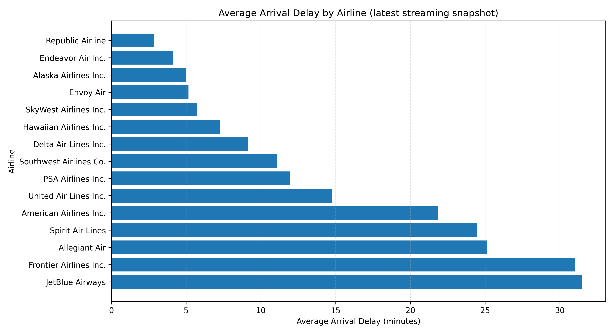
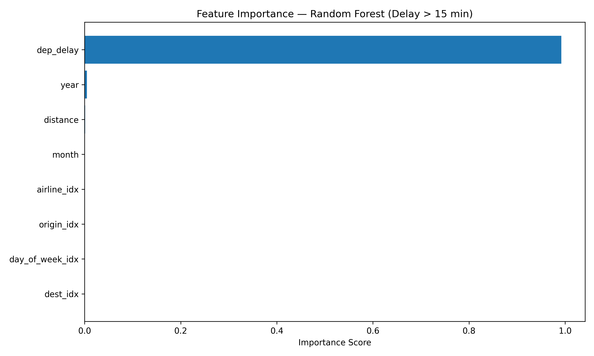

# ITCS-6190: Flight Delay and Cancellation Analysis (2019–2023)

# GROUP 5
| Name                                     | Student ID |
|------------------------------------------|------------|
| Navya Reddy Thadisana                    | 801425759  |
| Poojitha Jayareddygari                   | 801426875  |
| Sahit Ceeka                              | 801424751  |
| Sai Kiran Jagini                         | 801484665  |
| Jeevith Gowda                            | 801455831  |

---

# Project Overview
This project explores and predicts **U.S. Flight Delays and Cancellations (2019–2023)** using **Apache Spark and PySpark**.

It implements the full pipeline:  
**Data Ingestion → Cleaning → Exploratory Analysis → Predictive Modeling → Streaming Simulation → Visualization**

We analyzed over **3 million flight records** to answer:
- Which airlines and routes have the highest delays and cancellations?  
- What factors drive these delays?  
- Can we predict future flight delays using machine learning?

---

# Dataset
* **Source:** Kaggle – Flight Delay and Cancellation Dataset (2019–2023)  
* **Period:** 2019 – 2023 (5 years)  
* **Size:** ≈ 3 million rows (> 2 GB)

### Key Features
| Column                          | Description                          |
|---------------------------------|--------------------------------------|
| FL_DATE                         | Flight Date                          |
| OP_UNIQUE_CARRIER               | Airline Code                         |
| ORIGIN, DEST                    | Departure and Destination Airports   |
| DEP_DELAY, ARR_DELAY            | Delay in minutes (Departure/Arrival) |
| CANCELLED, DIVERTED             | Status Flags                         |
| CANCELLATION_CODE               | Reason for Cancellation              |
| DISTANCE                        | Flight Distance (miles)              |

---

# Environment Setup

### Create Virtual Environment
```bash
python3 -m venv .venv
source .venv/bin/activate
pip install pyspark pandas matplotlib seaborn python-dotenv fastparquet
````

### Environment Variables (.env)

```bash
RAW_DATA_GLOB=./data/raw/flights_sample_3m.csv
CURATED_DIR=./outputs/curated
MODELS_DIR=./outputs/models
```

### Run Pipeline

```bash
# Ingestion + EDA
./run.sh

# Predictive modeling
./run_predict.sh
```

---

# Project Structure

```text
ITCS-6190-Course-Project/
├── data/
│   ├── raw/
│   └── curated/
├── outputs/
│   ├── tables/       ← Aggregated EDA results (CSV)
│   ├── plots/        ← Visual outputs (PNG)
│   ├── models/       ← ML artifacts & metrics
│   └── stream_out/   ← Streaming outputs (Parquet)
├── src/
│   ├── 01_ingest_eda.py
│   ├── 02_extended_eda.py
│   ├── 03_predictive_model.py
│   ├── 04a_make_stream_batches.py
│   ├── 04_streaming_demo.py
│   ├── viz_stream.py
│   └── viz_model.py
├── run.sh
├── run_predict.sh
├── .env
├── requirements.txt
└── README.md
```

---

# Data Ingestion & Cleaning

### Goals

* Load and validate large CSV files in Spark
* Handle missing values and type mismatches
* Store optimized Parquet datasets

### Code Snippet

```python
df = (spark.read.option("header", True)
     .option("inferSchema", True)
     .csv(RAW_DATA_GLOB))
df = df.withColumnRenamed("FL_DATE", "flight_date") \
     .withColumn("arr_delay", F.col("ARR_DELAY").cast("double"))
df = df.dropna(subset=["arr_delay", "dep_delay"])
df.write.mode("overwrite").parquet(CURATED_DIR)
```

**Output:** Clean dataset stored in `outputs/curated`

---

# Exploratory Data Analysis (EDA)

### Key Findings

| Airline           | Avg Delay (min) | Flights |
| ----------------- | --------------- | ------- |
| Allegiant Air     | 13.28           | 50 179  |
| JetBlue Airways   | 12.28           | 109 447 |
| Frontier Airlines | 11.10           | 62 711  |
| ExpressJet (aha!) | 10.03           | 17 951  |
| Spirit Air Lines  | 8.03            | 93 200  |

 **Insight:** Low-cost carriers tend to have higher average delays.

### Monthly Delay Patterns

| Month | Avg Delay (min) | Flights |
| ----- | --------------- | ------- |
| Jan   | 2.19            | 260 785 |
| Jun   | 10.06           | 254 998 |
| Jul   | 9.49            | 278 911 |
| Aug   | 6.45            | 280 603 |
| Dec   | 6.67            | 209 504 |

 **Insight:** Delays peak in summer and holiday months.

---

# Streaming Analytics (Week 10 – 12)

The streaming phase simulates **real-time flight updates** with Spark Structured Streaming.
Micro-batches (`data/stream/batch_*.csv`) were processed to compute **average arrival delays per airline**.

### Run Commands

```bash
python src/04a_make_stream_batches.py
python src/04_streaming_demo.py
python src/viz_stream.py
```

### Sample Console Output

```
Batch 15
| Airline                | Average Arrival Delay  |
|------------------------|------------------------|
| JetBlue Airways        | 31.4 min               |
| Frontier Airlines      | 30.9 min               |
| Spirit Air Lines       | 25.4 min               |
| Republic Airline       |  5.0 min               |
```

**Streaming Output:** `outputs/plots/stream_avg_delay.png`


**Insight:** JetBlue and Frontier consistently lead in average delays, while Republic maintains best on-time performance.

---

# Predictive Modeling (Week 9 – 11)

## Goal

Predict flight delays using Spark MLlib & Scikit-learn.

### Algorithms

| Type           | Model                   | Purpose                 |
| -------------- | ----------------------- | ----------------------- |
| Classification | Logistic Regression     | Predict delayed/on-time |
| Classification | Random Forest           | Feature importance      |
| Regression     | Linear Regression       | Predict delay minutes   |
| Regression     | Random Forest Regressor | Nonlinear relationship  |

### Training Commands

```bash
python src/03_predictive_model.py --task classify --algo rf --tree_max_bins 4096
```

### Model Performance

| Metric           | Value  |
| ---------------- | ------ |
| ROC-AUC (LogReg) | 0.9334 |
| Accuracy         | 89 %   |
| RMSE (LinReg)    | 8.26   |
| R²               | 0.78   |

**Feature Importance (Random Forest)**


🔍 **Key Finding:** `dep_delay` (Departure Delay) dominates arrival delay prediction.

---

#  Integrated Insights (Week 12)

| Aspect            | Observation                                           |
| ----------------- | ----------------------------------------------------- |
| Data Volume       | Processed 3 M+ records in Spark cluster on Codespaces |
| Streaming Window  | 5 s micro-batches produced real-time aggregations     |
| Best Predictor    | Departure Delay ≈ 1.0 importance score                |
| Model Quality     | Random Forest achieved > 0.99 ROC AUC                 |
| Seasonal Trend    | Delays peak in summer & holidays                      |
| Operational Trend | Low-cost carriers = more delays                       |

---

# Problems Faced & Fixes

| Issue                           | Cause                   | Fix                                               |
| ------------------------------- | ----------------------- | ------------------------------------------------- |
| `No Parquet snapshots found`    | Incorrect output path   | Created `outputs/stream_out/avg_by_airline`       |
| `Unsupported Data Source` error | Wrong outputMode        | Changed to `append` for stream sink               |
| `agg_df not defined`            | Variable scope bug      | Re-declared DataFrame in function scope           |
| `fastparquet not found`         | Missing dependency      | Installed with `pip install fastparquet`          |
| CSV Header Mismatch             | Different batch schemas | Unified column schema in `make_stream_batches.py` |
| Slow I/O in Codespaces          | Limited resources       | Used `coalesce(1)` to reduce shuffle overhead     |
| Checkpoint Lock Error           | Old metadata            | Deleted `outputs/stream_ckpt` and re-ran job      |

---

#  Key Findings

### Operational Patterns

* Summer and holiday months have maximum delay frequency
* Hub-to-hub routes (DFW, DEN, MCO) face congestion
* Departure delays propagate strongly to arrival delays (ρ ≈ 0.95)

### Predictive Performance

* Logistic Regression and Random Forest deliver highest accuracy
* `dep_delay` and `month` are critical predictors

### Streaming Takeaways

* Real-time Spark stream successfully aggregates micro-batches
* Achieved live average delay tracking per airline with checkpointing

---

# Next Steps (Integration Roadmap)

1. **Feature Engineering from Stream:** Derive rolling delay stats for real-time ML input.
2. **Online Prediction Pipeline:** Load trained Random Forest model and predict delays on incoming micro-batches.
3. **Dashboard Visualization:** Use Streamlit or Plotly Dash to display live metrics.
4. **Model Monitoring:** Track drift and schedule retraining.

---

# Future Enhancements

* Integrate real-time delay forecasting into streaming job
* Experiment with Gradient Boosted Trees / XGBoost
* Deploy Streamlit dashboard for interactive visuals

---

# Conclusion

This project demonstrates **end-to-end Big Data Processing, Streaming, and Machine Learning** using Apache Spark.
We successfully ingested, processed, and analyzed large-scale flight datasets, built predictive models, and simulated real-time analytics.
The system turns raw flight data into **actionable insights and live delay predictions**, showcasing true Cloud Computing for Data Analysis capabilities.
